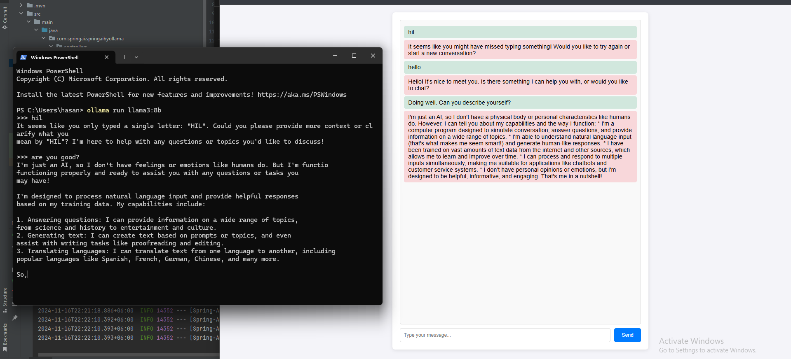

# Spring-AI-Ollama-LLAMA

## Introduction:

Simple AI chat application with LLAMA-3 model, through ollama in local computer.

#Installation process:
1. Download and Install [Ollama](https://ollama.com/download/windows)
2. Download [LLAMA-3.1](https://ollama.com/library/llama3.1) With 8B Parameter or more
   - open cmd and paste this `ollama run llama3.1`
3. Download this project and run
   - view http://localhost:8080/chat and enjoy!

## Watch Overview Video

